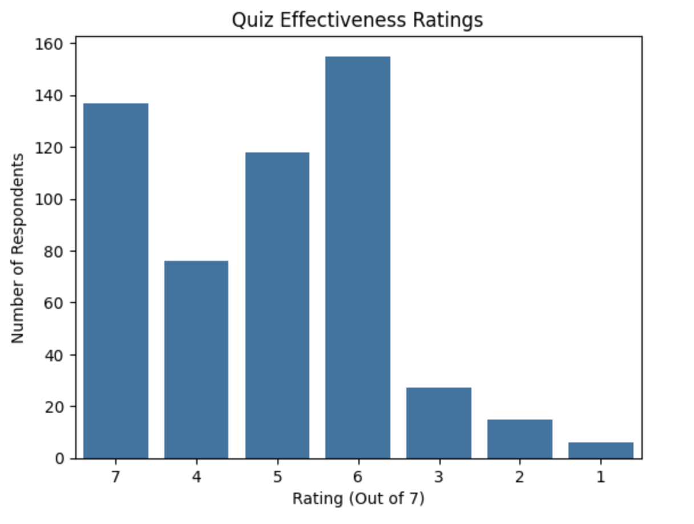
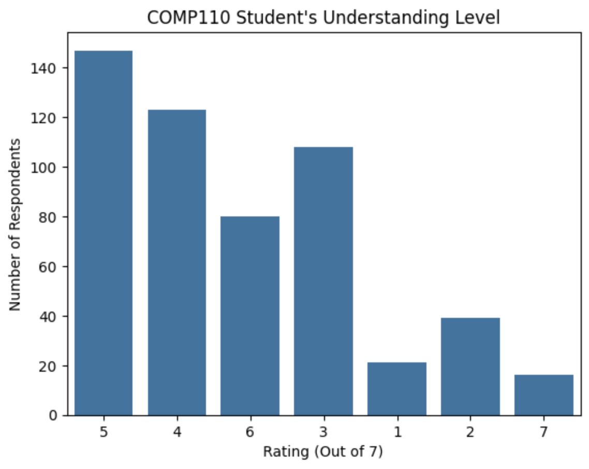
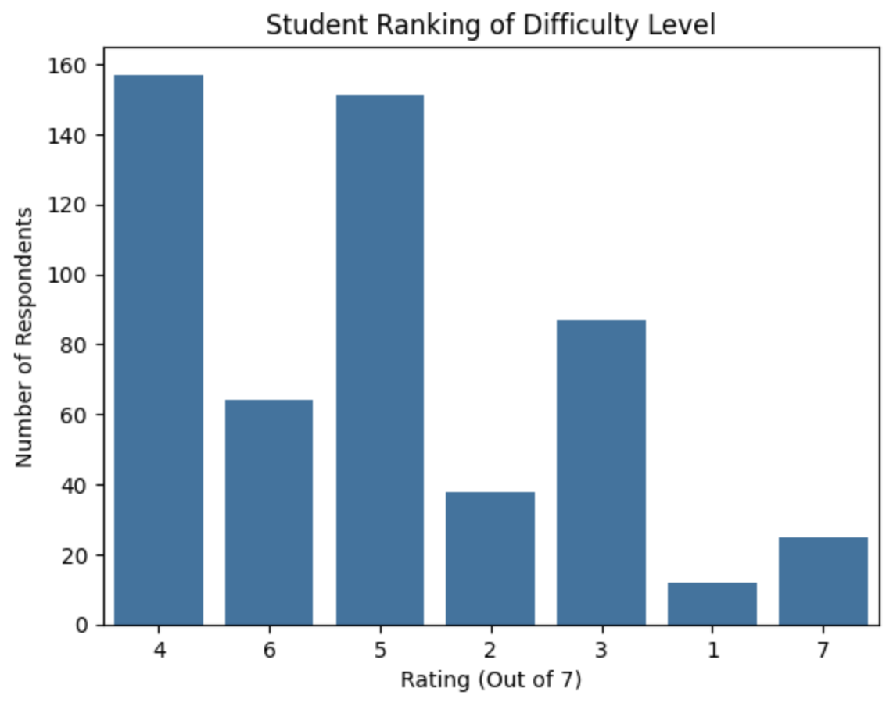
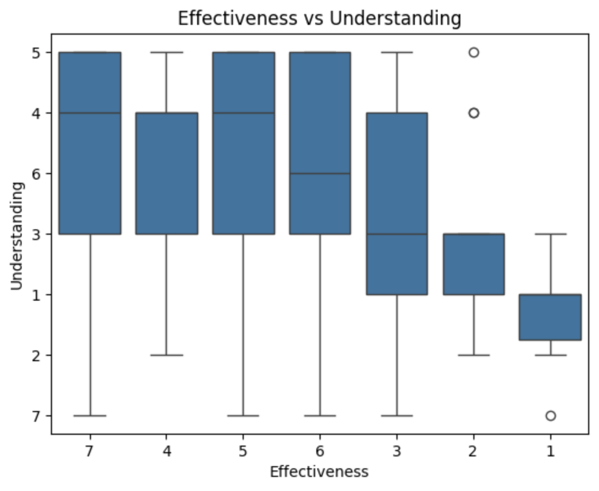
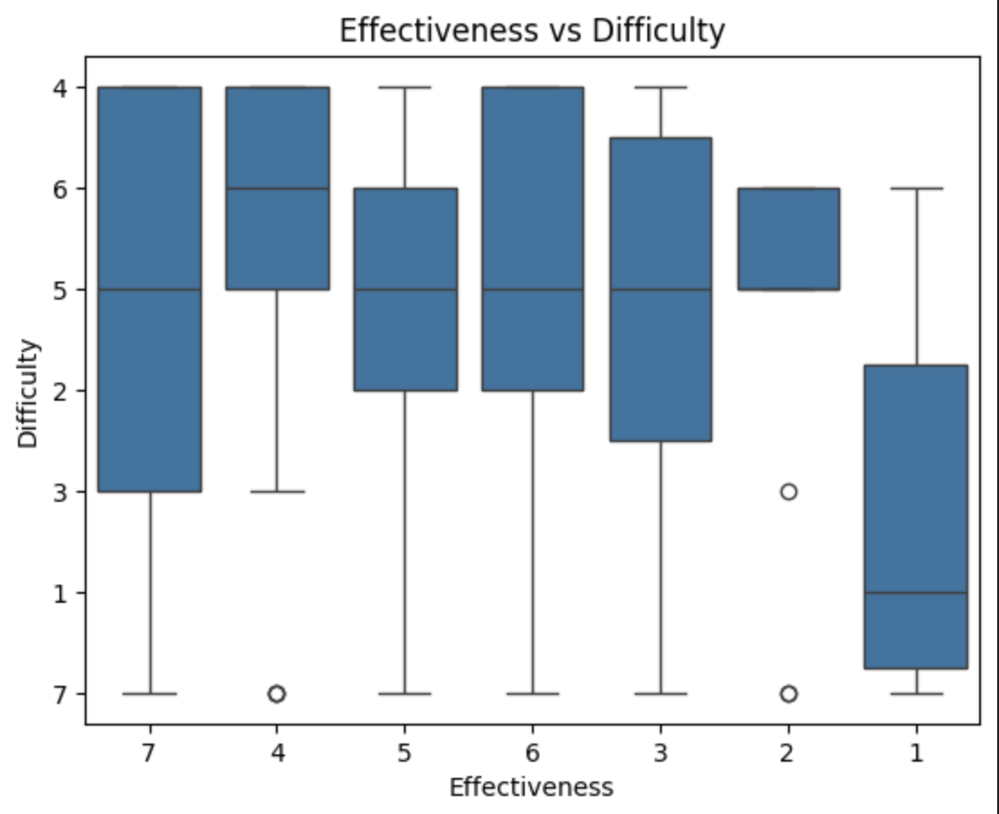

---
# Do not edit the text between these lines!
layout: default
---

# Diya's EX09 Data Analysis Website!

<!-- This is a comment. Below, you'll see code for inserting an image. To make this image appear, update <custom-path>. To add an image, save it inside the imgs folder of this repository. -->

## Below you will find 5 plots outlining the data we chose to report on. We have a total of 3 variables: Quiz Effectiveness, Understanding, and Difficulty. 

## Figure 1. Quiz Effectiveness Rating Plot:

## Figure 2. COMP110 Student's Understanding Level Plot:

## Figure 3. Difficulty Level Plot:

## Figure 4. Quiz Effectiveness vs Student's Understanding Plot:

## Figure 5. Quiz Effectiveness vs Difficulty Level Plot:

## Our Project Analysis:
Our analysis was supported by our data as we got the most number of responses, around 140 students and 160 students, for the ratings of 7 and 6. This means that the most students said that the practice questions were effective in helping them prepare for the actual quizzes. 
To further refine our data we can ask what parts of the practice quizzes helped them the most, that being the formatting or the amount of mcq compared to code writing questions. On the opposing side, the trade-offs that come with these quizzes is that students might become too accustomed to the formatting of the quizzes, making it so that if the true quizzes are foramtted even slightly differently, it will throw students off and cause them to struggle on the quizzes.